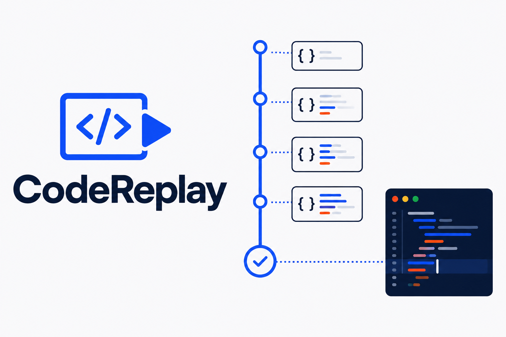

# CodeReplay

**Replay the decisions, not another tutorial.**

CodeReplay turns the latest commits from a public GitHub repository into a short, hands-on lesson. Learners can move through real source changes, see which lines changed, recreate a checkpoint, and verify their work against the original commit.

[Open the live demo](https://codereplay.vercel.app/) · [View on Devpost](https://devpost.com/software/codereplay)



## Why it exists

Video tutorials show a finished answer. Git history contains the decisions that produced it, but raw commit pages are difficult for newer developers to learn from. CodeReplay makes that history approachable without inventing explanations or replacing the source with generated code.

## What works

- Import any public GitHub repository from its URL.
- Read up to six recent commits through GitHub's public API.
- Find a readable source file changed by each commit.
- Load the file exactly as it existed at that commit.
- Highlight lines that differ from the previous checkpoint when both commits use the same file.
- Open the original repository or commit for verification.
- Switch to Practice mode, edit the source, and check for an exact match.
- Restore the source after a failed attempt.
- Use the built-in lesson or load a real example with one click.
- Navigate by keyboard and use the interface on mobile layouts.

## How the import works

1. The URL is parsed into an owner and repository.
2. CodeReplay requests the six latest commits.
3. Each commit is inspected for a non-generated source file.
4. The file content is fetched at that exact commit SHA.
5. Usable commits are reversed into chronological lesson checkpoints.

Everything happens in the browser. There is no database, account system, server, GitHub token, or AI-generated replacement code.

## Run locally

```bash
npm install
npm run dev
```

Create a production build with:

```bash
npm run build
```

## Stack

- React
- Vite
- GitHub REST API
- Lucide icons
- Vercel

## Current limits

- Public repositories only.
- GitHub's unauthenticated API rate limit applies per visitor.
- CodeReplay currently chooses the first readable source file in each commit.
- Practice verification checks source equality; it does not execute untrusted code.
- Very large files and generated or lock files are skipped.

These constraints keep the public demo fast, private, and safe. A production expansion could add GitHub OAuth, file selection, commit ranges, syntax-aware diffs, and sandboxed tests.

## Privacy and safety

Repository data is requested directly from GitHub and remains in the visitor's browser session. CodeReplay does not collect code, credentials, or personal data. It never executes imported repository code.
